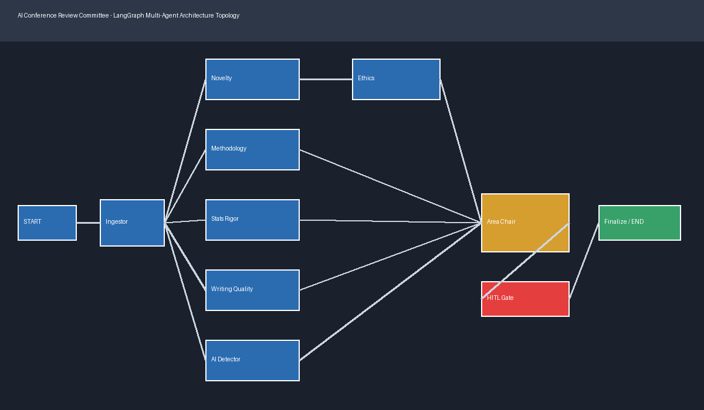

# AI Conference Review Committee

An explainable multi-agent paper review platform: a LangGraph supervisor orchestrates specialist agents that inspect research papers for novelty, methodology, statistical rigor, writing quality, ethics, and AI-generated phrasing. Every review is stored in shared state, traced in the UI, and paused for human approval before the final decision.

New here? [docs/GETTING_STARTED.md](docs/GETTING_STARTED.md) covers installation, API keys, the dashboard workflow, sample papers, and troubleshooting.

Architecture and graph execution: [docs/ARCHITECTURE.md](docs/ARCHITECTURE.md).

Agent responsibilities and extension points: [docs/AGENTS.md](docs/AGENTS.md).



## Prerequisites

- Python 3.10 or newer
- pip
- Optional Groq API key for LLM-backed novelty and methodology review
- Optional Tavily API key for live related-paper search

The application has local analysis and offline fallbacks, so it can run without external API keys. See [Getting Started](docs/GETTING_STARTED.md) for the exact environment configuration.

## Quickstart

```powershell
cd D:\Review_paper_Checker
python -m venv .venv
.venv\Scripts\Activate.ps1
python -m pip install --upgrade pip
pip install -r requirements.txt
python -m streamlit run ui/app.py
```

Open the local URL printed by Streamlit. The default is `http://localhost:8501`; if the port is busy, Streamlit selects another available port.

Run the test suite:

```powershell
python -m pytest -q
```

## Review Workflow

Upload a PDF, TXT, or Markdown paper, or choose a bundled benchmark paper. The committee then:

1. Extracts the paper text and academic sections.
2. Indexes paper chunks in ChromaDB using a content-derived paper identifier.
3. Runs six specialist reviews over the shared `ReviewState`.
4. Aggregates findings with the Area Chair weighted rubric.
5. Pauses before finalization for human approval, editing, retry, or rejection.
6. Exports the final review as Markdown or PDF.

The Streamlit dashboard includes Dashboard, Live Trace, Communication Log, Graph Topology, Token / Cost, Logs & Errors, Memory Viewer, Human Controls, and Final Report tabs.

## Review Agents

| Agent | Role |
| --- | --- |
| Paper Ingestor | Extracts text, parses sections, and indexes chunks. |
| Novelty Checker | Searches related work and evaluates contribution positioning. |
| Methodology Reviewer | Checks reproducibility, baselines, ablations, datasets, and experiments. |
| Statistical Rigor Checker | Extracts and evaluates p-values, sample sizes, confidence intervals, and error reporting. |
| Writing Quality Reviewer | Measures readability and checks structure and captions. |
| Ethics/Plagiarism Agent | Checks ethics disclosures, conflicts, dual-use risk, and text overlap. |
| AI Content Detector | Estimates synthetic sentence patterns and writing authenticity. |
| Area Chair Supervisor | Applies the weighted rubric and drafts the committee decision. |

The Area Chair rubric weights methodology at 25%, novelty at 20%, statistical rigor at 20%, writing at 10%, ethics at 15%, and AI detection at 10%. High-risk ethics flags can veto the weighted score.

## LLM Providers

Novelty and methodology agents use Groq when `GROQ_API_KEY` is configured. The default model is `openai/gpt-oss-20b`, and it can be overridden with `GROQ_MODEL`.

The Token / Cost tab records whether each row came from `groq`, `heuristic_fallback`, or local deterministic analysis. A fallback is reported explicitly when a provider is unavailable or returns invalid structured output; the rest of the review continues.

```dotenv
GROQ_API_KEY=your_groq_api_key
GROQ_MODEL=openai/gpt-oss-20b
TAVILY_API_KEY=your_tavily_api_key
```

## Memory And Observability

- ChromaDB persists paper chunks under `memory/chroma_db/`.
- LangGraph checkpoints active human-review threads through the local SQLite checkpointer.
- Structured execution logs are written to `logs/execution.json`.
- Uploaded papers are stored under `data/uploads/` for the current workspace.

## Safety Defaults

- The system does not execute external actions or publish decisions automatically.
- Every review pauses before final decision commitment.
- Human feedback and approval are recorded in the review state.
- API keys are loaded from `.env` and must never be committed.
- Statistical, ethics, and AI-detection results are review aids, not substitutes for expert judgment.

## Development

| Command | Purpose |
| --- | --- |
| `python -m pytest -q` | Run the complete test suite. |
| `python run_tests.py` | Run tests through the project test runner. |
| `python -m streamlit run ui/app.py` | Start the review dashboard. |
| `python generate_diagram.py` | Regenerate the architecture diagram. |

## Repository Structure

```text
paper-checker-Agentic-AI/
├── agents/                 # Ingestor, specialist, and supervisor agents
├── data/sample_papers/     # Bundled benchmark papers
├── docs/                   # Getting started, architecture, and agent guides
├── graph/                  # ReviewState and LangGraph topology
├── logging_utils/          # Structured execution logging and cost estimates
├── memory/                 # ChromaDB vector store and graph checkpointer
├── tests/                  # State, tool, and graph smoke tests
├── tools/                  # PDF, search, RAG, stats, and provider helpers
├── ui/                     # Streamlit app and dashboard components
├── requirements.txt
└── README.md
```
