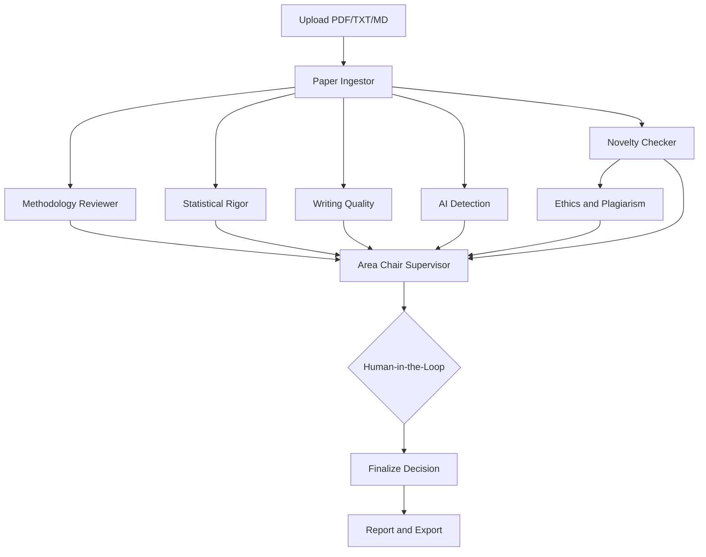

# Architecture

The project is a local-first, multi-agent review workflow. Streamlit provides the operator interface, LangGraph coordinates state transitions, and ChromaDB stores searchable paper chunks.

## Workflow

## Shared State

`graph/state.py` defines `ReviewState`, the typed state passed through the graph. It contains:

- paper path, extracted text, and structured sections
- six specialist reports
- Area Chair meta-review and decision status
- human feedback and approval state
- append-only trace, token usage, and error records

## Graph Execution

`graph/build_graph.py` creates the LangGraph topology:

1. `ingestor` extracts paper content and indexes chunks.
2. Novelty, methodology, statistics, writing, and AI detection run from the ingested state.
3. Ethics runs after novelty because it can use retrieved related work.
4. The Area Chair aggregates all specialist reports with a weighted rubric.
5. Execution pauses before `finalize` for human review.
6. Human action resumes the graph and commits the final decision.

LangGraph uses a SQLite checkpointer when available, allowing the HITL gate to resume from the active thread.

## Storage

- `memory/chroma_db/`: persistent Chroma collections for paper chunks and related work
- `logs/execution.json`: structured agent and operation logs
- `data/uploads/`: uploaded paper workspace

Paper chunks use a SHA-256 content identifier so papers with similar titles do not overwrite one another.

## LLM Boundary

The LLM integration is isolated in `tools/groq_tools.py`. Novelty and methodology send paper-specific prompts to Groq. The remaining agents use local extraction and heuristic analysis. When Groq is unavailable or returns invalid structured output, the affected agent records a local fallback provider instead of stopping the full review.

## UI Surface

`ui/app.py` exposes nine tabs:

- Dashboard
- Live Trace
- Communication Log
- Graph Topology
- Token / Cost
- Logs & Errors
- Memory Viewer
- Human Controls
- Final Report
